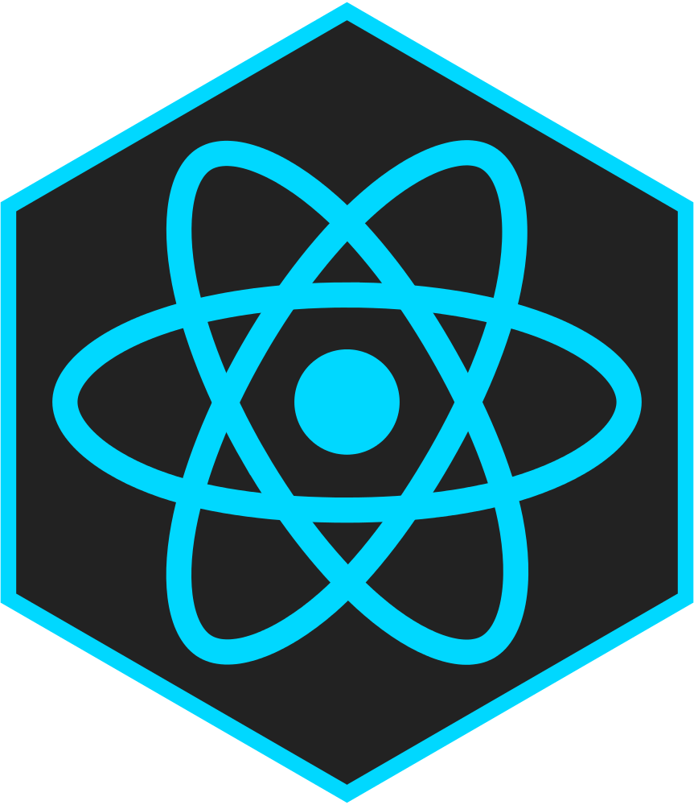

# FastAPI React MongoDB - Base Project Generator

[](https://github.com/ajthr/fastapi-react-mongodb/actions/workflows/test.yml) 

<div>
  &nbsp; &nbsp;  &nbsp;&nbsp;&nbsp;

</div>

## Features

- **[FastAPI](https://fastapi.tiangolo.com/)** (Python 3.8)
  - JWT authentication using [OAuth2 "password
    flow"](https://fastapi.tiangolo.com/tutorial/security/simple-oauth2/) and
    PyJWT
- **[React](https://reactjs.org/)** (with Typescript)
  - [react-router v5](https://reacttraining.com/react-router/) to handle routing
- **[MongoDB](https://www.mongodb.com/)** for the database
- **[PyMongo](https://pymongo.readthedocs.io/)** for ODM
- **[Pytest](https://docs.pytest.org/en/latest/)** for backend tests.
- **[Docker Compose](https://docs.docker.com/compose/)** for development
- **[Nginx](https://www.nginx.com/)** as a reverse proxy to allow
  backend/frontend on the same port

## Quick Start

First, install cookiecutter if you don't already have it:

```bash
pip3 install cookiecutter
```

Second, install docker-compose if you don't already have it:

[docker-compose installation official
docs](https://docs.docker.com/compose/install/).

Then, in the directory you want your project to live:

```bash
cookiecutter gh:ajthr/fastapi-react-mongodb
```

<details><summary>Input Variables</summary>

- project_name [default fastapi-react-mongodb]
- project_slug [default fastapi-react-mongodb] - this is your project directory
- external_database [default n] - whether to use any external database like mongodb atlas
- external_db_uri [optional default None] - database uri to connect to external database if using one.
- mongodb_user [default root]
- mongodb_password [default password]
- secret_key [default super_secret]

</details>

## Develop

Change into your project directory and run:

```bash
docker-compose build
```

This will build and run the docker containers.

It may take a while to build the first time it's run since it needs to fetch all
the docker images.

Once you've built the images once, you can simply use regular `docker-compose`
commands to manage your development environment, for example to start your
containers:

```bash
docker-compose up -d
```

Once this finishes you can navigate to the localhost port, you should see the slightly modified create-react-app page.

## Testing

To run test for the template, run:

```bash
chmod +x ./test.sh
./test.sh
```

To run test for api, run
```bash
docker-compose run --rm api sh -c "pytest"
```

to run test for web, run
```bash
docker-compose run --rm web sh -c "npm run test"
```
